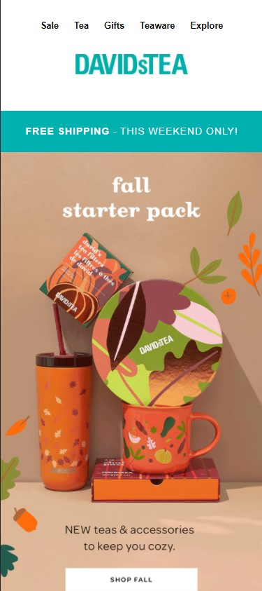
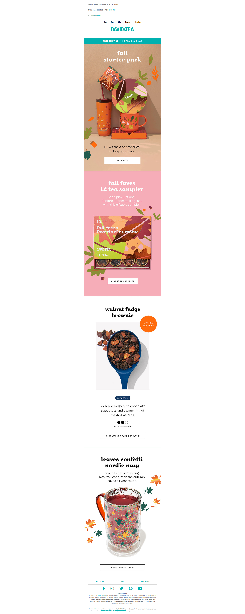

# DAVIDsTEA Promo Email Clone<!-- omit in toc -->

This is a project to make a clone of a DAVIDsTEA promotion email that went out September 4, 2021.

## Version 1.0<!-- omit in toc -->

- **Project Start/End:** September 5, 2021

# CONTENTS
- [CONTENTS](#contents)
  - [Introduction](#introduction)
  - [Screenshots](#screenshots)
    - [MOBILE](#mobile)
    - [DESKTOP](#desktop)
  - [Methodology](#methodology)
  - [Tools I Used](#tools-i-used)
  - [Items for further study](#items-for-further-study)
  - [About me](#about-me)
 

Introduction
---

I chose to clone a DAVIDsTEA email because, well, I like tea (lol). Also, putting together simple layouts like this is what would be expected when developing emails, so the more practice, the better.

I did both the English and French version of the email.

 

Screenshots
---

### MOBILE

### DESKTOP

 

Methodology
---

On the email, I clicked to view the email on a separate screen. I extracted the images using the program [Eagle](https://eagle.cool/), fixed up the Logos in Photoshop (get rid of the white background), and went to the main website to get the color code for the main green colour.

 

Tools I Used
---
- HTML5
- CSS3
- Mobile-First Design

 

Items for further study
---

I noticed when looking at the email via Dev Tools, they used a Table to place the items. Next time I build a promo email clone, I'll give putting items in a table a shot. 

 

About me
---

Thanks for checking out this project! 😃 You can find my profiles at these sites:

- [Personal website](https://www.sonjigoodman.com)
- [Twitter: @IT_Sonji](https://twitter.com/sonji_it)
- [Frontend Mentor - @infinity-Mineeva](https://www.frontendmentor.io/profile/Infinity-Mineeva)
